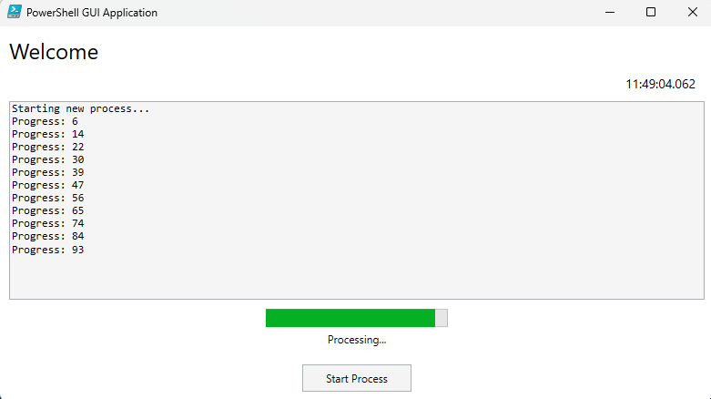

# PowerShell GUI Template

A modern PowerShell GUI application template demonstrating non-blocking background task execution with real-time progress updates. This template showcases how to build responsive Windows desktop applications using PowerShell and XAML, with a focus on proper thread management and UI responsiveness.

<div align="center">
    
</div>

## Key Features

- 🔄 Non-blocking background task execution
- 📊 Real-time progress updates with visual feedback
- ⚡ Responsive UI with visual confirmation
- 🎯 Thread-safe UI updates
- 🧩 Modular, maintainable architecture
- 🎨 Customizable XAML-based interface

## Core Concepts

### Thread Management
- Main UI thread remains responsive during long operations
- Background jobs handle intensive processing
- Visual indicator confirms UI thread responsiveness
- Timer-based progress updates without blocking

### Progress Tracking
- Real-time progress bar updates
- Status text updates for operation states
- Visual spinning indicator for UI responsiveness
- Timestamp display showing active UI thread

## Project Structure

```
MyPowerShellApp/
├── src/
│   ├── GUI/
│   │   ├── MainWindow.xaml       # Main window with progress elements
│   │   └── LoginWindow.xaml      # Authentication interface
│   ├── Modules/
│   │   ├── Authentication.psm1   # Login functionality
│   │   ├── GuiManager.psm1       # Window and control management
│   │   ├── BackgroundJobs.psm1   # Thread and progress handling
│   │   └── XamlLoader.psm1       # XAML parsing utilities
│   ├── Themes/
│   │   └── Theme.ps1             # UI customization
│   ├── Create-AppShortcut.ps1    # Script that creates the shortcut to the app
│   ├── Create-Shortcut.bat       # Run this file to create the desktop shortcut
│   └── Main.ps1                  # Application entry point
└── README.md
```

## How It Works

### 1. Background Job Management

This template leverages PowerShell's background job functionality to run intensive tasks on separate threads, ensuring that the UI remains responsive during long-running operations.

```powershell
# BackgroundJobs.psm1 handles threaded operations
function Start-LongRunningProcess {
    param([ScriptBlock]$ProcessLogic)
    
    # Creates a new background job to handle intensive tasks on a separate thread
    $job = Start-Job -ScriptBlock $ProcessLogic
    return $job
}
```
- Start-Job: Executes the provided script block on a separate thread, allowing the main thread (UI) to stay responsive.
- Job management: The background job handles the execution of the task, and results can be processed asynchronously.

### 2. Progress Monitoring

To ensure that progress is tracked and reflected in the UI without blocking it, a timer is used to periodically fetch and update progress from the background job.

```powershell
# Timer-based progress updates
function New-ProgressTimer {
    param(
        [hashtable]$UIElements,
        [System.Management.Automation.Job]$Job
    )
    
    # Sets up periodic checks for progress updates from the job
    # Ensures the UI is updated with progress without blocking
}
```
- Timer: Periodically checks the background job for progress updates (e.g., percent completion, status).
- UI Update: Safely updates the UI (progress bar, status text) on each timer tick, ensuring the UI remains responsive.

### 3. UI Responsiveness Indicator
To visually indicate that the UI is still responsive, a spinning animation is displayed during the background process. The spinner freezes if the UI thread becomes blocked.

```powershell
# Visual confirmation of responsive UI
function New-UIResponsivenessTimer {
    param([hashtable]$UIElements)
    
    # Shows a spinning animation and updates the timestamp
    # The spinner stops if the UI thread becomes unresponsive
}
```
- Spinner: A rotating spinner gives users visual feedback that the UI is still actively processing.
- Timestamp: A real-time timestamp is updated, providing continuous feedback on time elapsed during the background process.

## Key Components

### 1. Background Job Management
- Separate thread for intensive operations
- Non-blocking progress updates
- Safe job cleanup and error handling

### 2. UI Responsiveness
- Spinning indicator shows active UI thread
- Real-time timestamp updates
- Visual feedback for user operations

### 3. Progress Tracking
- Progress bar with percentage complete
- Status text updates
- Detailed operation logging

## Implementation Examples

### Starting a Background Task
```powershell
$newJob = Start-LongRunningProcess -ProcessLogic {
    # Your intensive operation goes here
    1..100 | ForEach-Object {
        Start-Sleep -Milliseconds 50
        Write-Output $_  # Reports progress to the job
    }
}
```
- You can also pass a function with parameters to the backgroundjob

```powershell
# This function can be any function you want to pass to the background
$demoFunction = {
    param($startValue)
    1..100 | ForEach-Object {
        Start-Sleep -Milliseconds 100
        $progress = $startValue + $_
        Write-Progress -PercentComplete (($progress / 100) * 100) -Status "Processing..." -Activity "Job in Progress" -CurrentOperation "Progress: $progress"
        Write-Output $progress  # This sends the progress value back to the main script
    }
}

# Define the argument value for the job
$startValue = 0

# Start the background job using the function and initial parameter
$newJob = Start-LongRunningProcess -ProcessLogic $demoFunction -ArgumentList $startValue
```

### Monitoring Progress
```powershell
$timer = New-ProgressTimer -UIElements $UIElements -Job $newJob
$timer.Start()  # Begins progress tracking and updates UI
```

## Best Practices

1. **Thread Safety**
   - Use dispatcher for UI updates
   - Maintain proper job cleanup
   - Handle cross-thread operations safely

2. **Progress Updates**
   - Regular, non-blocking updates
   - Clear status communication
   - Proper error handling

3. **UI Responsiveness**
   - Visual confirmation of active UI
   - Proper thread management
   - Clean state management

## Customization

### 1. Modify Background Tasks
```powershell
# Update ProcessLogic in GuiManager.psm1
$ProcessLogic = {
    # Your custom processing here
    # Use Write-Output for progress
}

# Or pass your own function!
$demoFunction = ...
```

### 2. Update Progress Visualization
- Modify MainWindow.xaml for different progress elements
- Adjust timer intervals in BackgroundJobs.psm1
- Customize progress reporting format

### 3. Add Features
- Create new module files for additional functionality
- Update GuiManager.psm1 for new UI interactions
- Extend BackgroundJobs.psm1 for different job types

## Requirements

- Windows PowerShell 5.1+
- .NET Framework 4.5+

## License

MIT License - See LICENSE file for details.

This template demonstrates proper thread management and UI responsiveness in PowerShell GUI applications, serving as a foundation for building desktop tools with background processing capabilities.